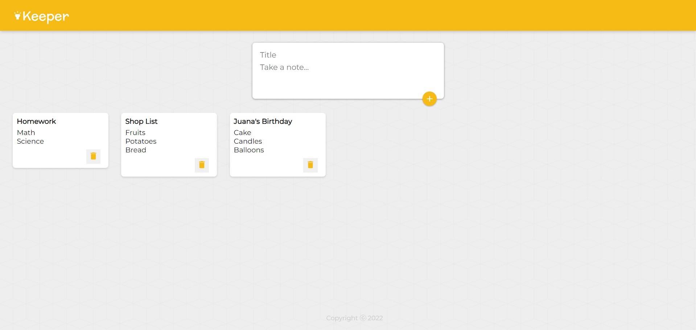
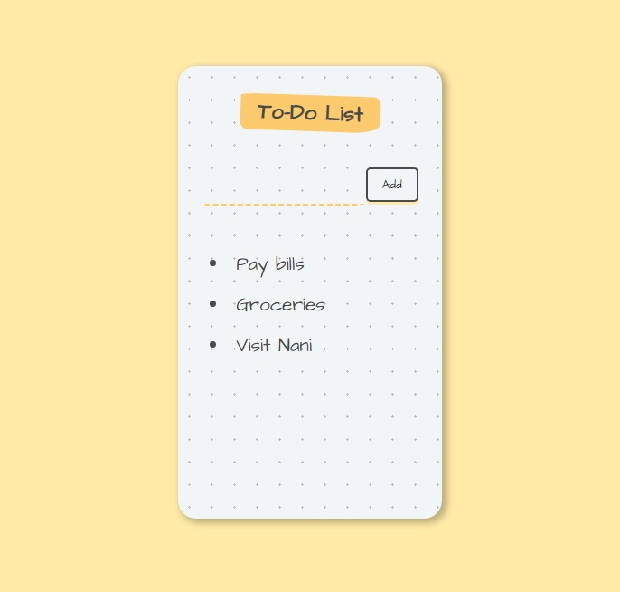
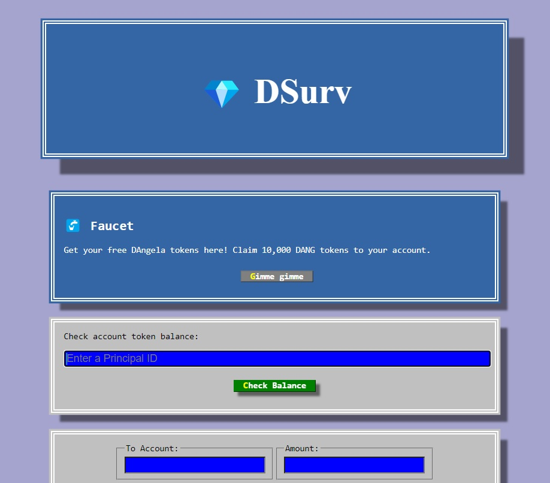
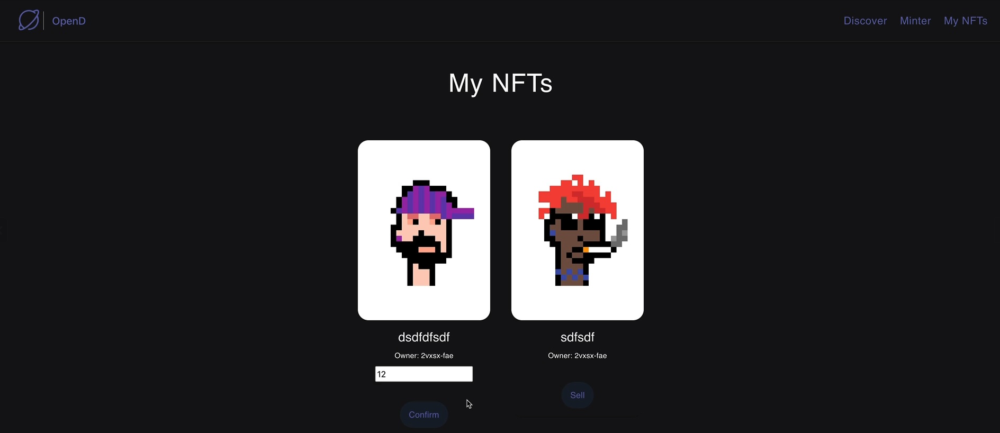
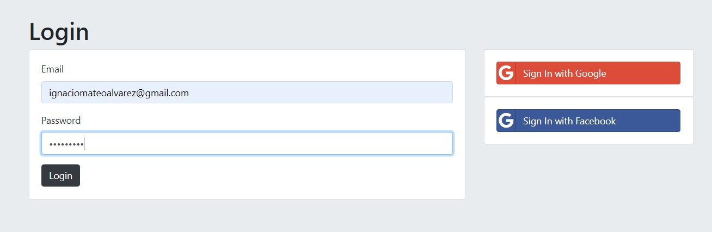
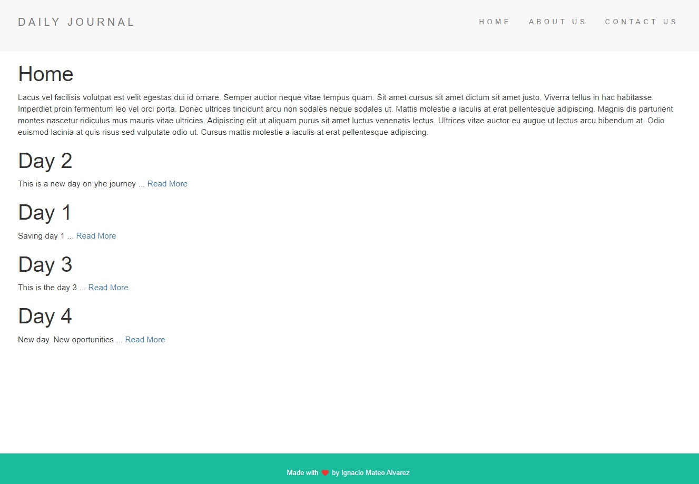
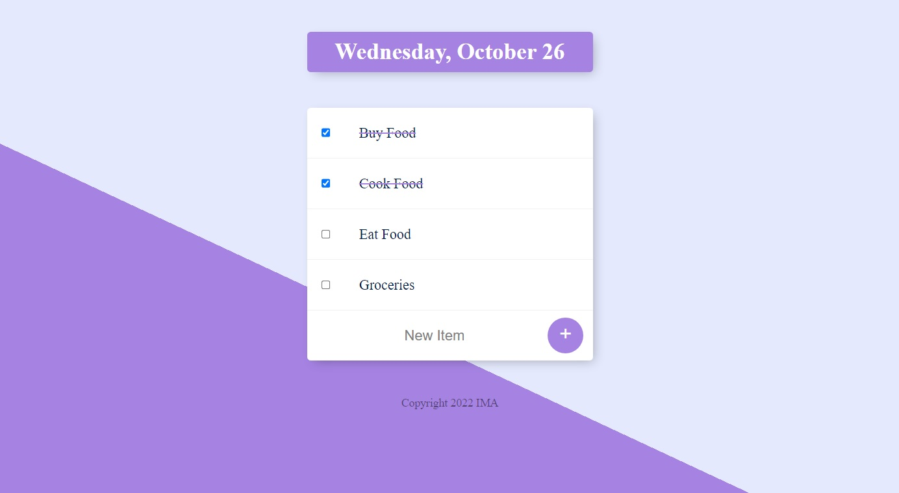
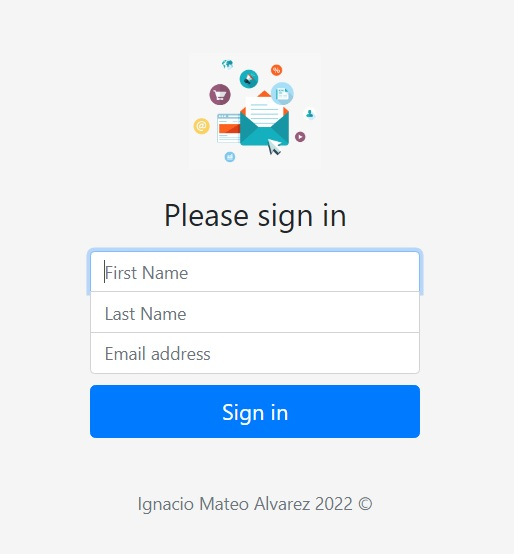
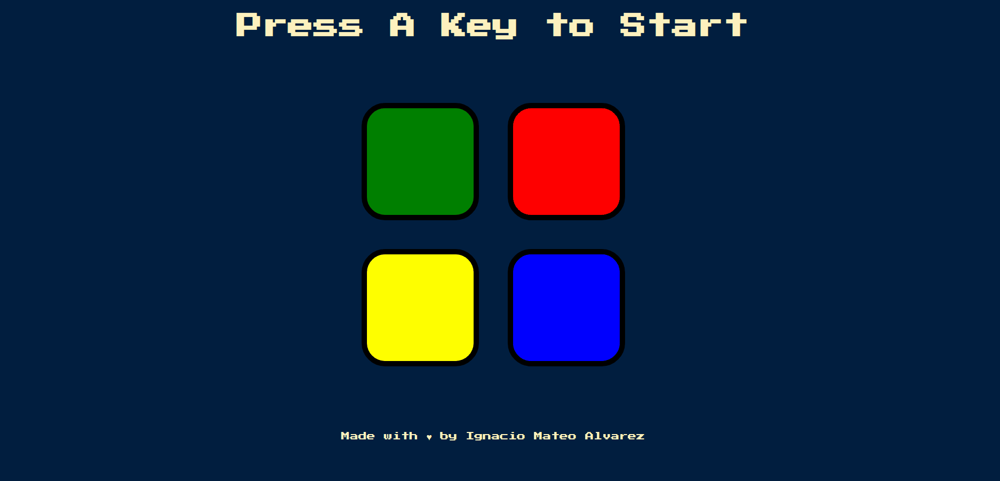
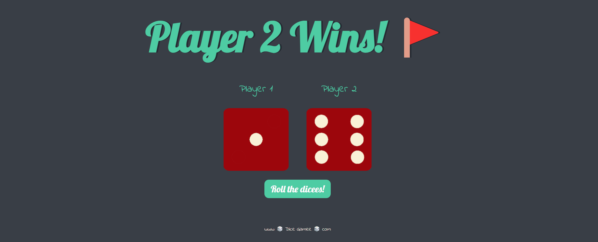

# Complete_Web_Development_Bootcamp | Udemy

## Notes
https://drive.google.com/drive/folders/1xvqV9dMPpZSA7zMLzKdt6PbvNQAlwmfd?usp=sharing

## Main Topics Covered
 - Front-End Web Development
 - HTML 
 - CSS 
 - Bootstrap 
 - Javascript ES6
 - DOM Manipulation
 - jQuery
 - Bash Command Line
 - Git, GitHub and Version Control
 - Backend Web Development
 - Node.js
   - NPM
     - Express
     - EJS
     - Body-parser
     - Request
     - Nodemon
     - Lodash
     - Mongoose
     - Mongoose-encryption
     - Dotenv
     - Md5
     - Bcrypt
     - Passport
 - REST
 - APIs
 - Databases
   - SQL
   - MongoDB
 - Mongoose
 - Authentication
 - Firebase
 - React.js
   - Components
   - Props
   - Babel
   - JSX
   - Map/Filter/Reduce
   - ES6 Arrow Functions
   - Hooks
   - JS Destructuring
 - Web Design
 - Deployment with GitHub Pages, Heroku and MongoDB Atlas
 - Web3 Development on the Internet Computer
 - Blockchain technology
 - Token contract development
 - NFT minting, buying and selling logic
 
 ## React Projects
 
 ### Keeper App
 
App de notas que podemos guardar para mas tarde, y luego elimaarlas. 

 ### TO-DO List
 
 Es una version anterior de Keeper App con una funcionalidad similar. 

 
 
 
  ### DBank
 
 Banco descentralizado usando Internet Computer, Motoko y React. 

 
 
 
   ### OpenD
 
 Inspirado en OpeanSea. Usa nuestra aplicacion anterior DBank para poder listar, comprar y vender NFTs usando las mismas tecnologias! 

 
 
 
 

## Node.js Projects

 ### Secrets
 
 App para alojar nuestros secretos de manera protegida. Usamos authentication, security, Auth2.0 w/ Google and Facebook. 

 
 
 
  ### Blog
 
 Blog diario con una base de datos en MongoDB usando EJS, Express.js y Lodash . 

 
 
 
  ### TO-DO List
 
 
 
 ### Newsletter
 
 Usamos Express.js, Mailchimp API, & Heroku. 

 
 
 
 ## Otros Proyectos (usando mucho Javascript, Bootstrap, HTML y CSS).
 
 ### Simon Game
 
 
 
  ### TinDog
 
 
 
  ### Dice Game
 
 
 
 ### Y muchos otros proyectos mas!
 
  ### La web del curso
  
 https://www.udemy.com/course/the-complete-web-development-bootcamp/ 

 
 

